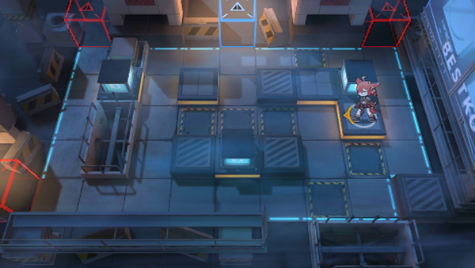

# 关卡一览————悖论模拟_睥睨

## 关卡一览

关卡编号: 悖论模拟_睥睨

关卡名称: 睥睨

目标点生命值: 1

敌人总数: 27

理智消耗: 0

## 关卡地图

## 敌人情况

| 敌人图片 | 敌人名称 | 数量  |
|---------|-----|-----|
| ./eneIcons/eneIcons/¸ß¼¶Îä×°ÈËÔ±.png| 高级武装人员  |   1  |
| ./eneIcons/eneIcons/DZ·üÕß.png| 潜伏者  |   12  |
| ./eneIcons/eneIcons/Îä×°ÈËÔ±.png| 武装人员  |   7  |
| ./eneIcons/eneIcons/ÒþÐÎåóÊÖ.png| 隐形弩手  |   6  |
| ./eneIcons/eneIcons/ÒþÐÎÊõʦ.png| 隐形术师  |   1  |
