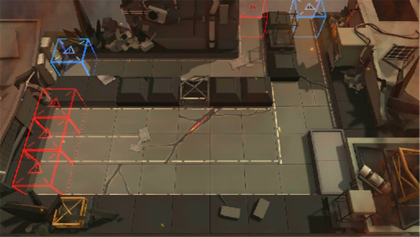

# 关卡一览————悖论模拟_耐心！

## 关卡一览

关卡编号: 悖论模拟_耐心！

关卡名称: 耐心！

目标点生命值: 1

敌人总数: 98

理智消耗: 0

## 关卡地图

## 敌人情况

| 敌人图片 | 敌人名称 | 数量  |
|---------|-----|-----|
| ./eneIcons/eneIcons/Êõʦ.png| 术师  |   2  |
| ./eneIcons/eneIcons/Դʯ³æ¡¤¦Â.png| 源石虫·β  |   93  |
| ./eneIcons/eneIcons/ÖØ×°·ÀÓùÕß.png| 重装防御者  |   3  |
