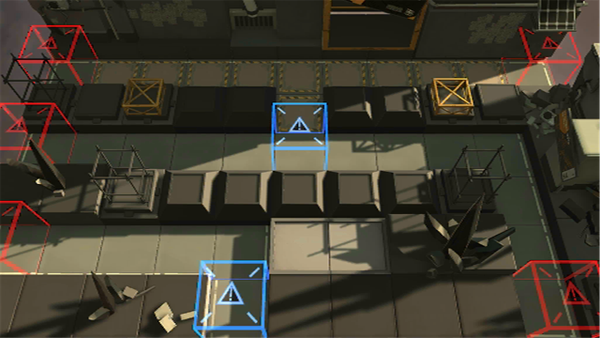

# 关卡一览————悖论模拟_良药苦口

## 关卡一览

关卡编号: 悖论模拟_良药苦口

关卡名称: 良药苦口

目标点生命值: 1

敌人总数: 56

理智消耗: 0

## 关卡地图

## 敌人情况

| 敌人图片 | 敌人名称 | 数量  |
|---------|-----|-----|
| ./eneIcons/eneIcons/¿ñ±©ËÞÖ÷ͶÖÀÊÖ.png| 狂暴宿主投掷手  |   5  |
| ./eneIcons/eneIcons/¿ñ±©ËÞÖ÷ÖÀ¹ÇÊÖ.png| 狂暴宿主掷骨手  |   4  |
| ./eneIcons/eneIcons/ÁÔ¹·pro.png| 猎狗pro  |   47  |
