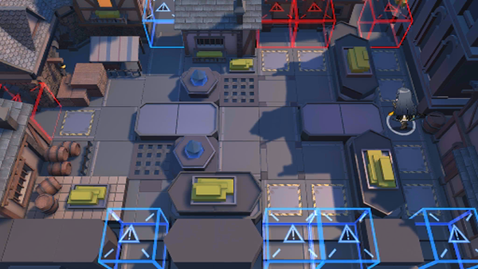

# 关卡一览————悖论模拟_花香四溢

## 关卡一览

关卡编号: 悖论模拟_花香四溢

关卡名称: 花香四溢

目标点生命值: 1

敌人总数: 46

理智消耗: 0

## 关卡地图

## 敌人情况

| 敌人图片 | 敌人名称 | 数量  |
|---------|-----|-----|
| ./eneIcons/eneIcons/¶¬ÁéÁÔÈ®pro.png| 冬灵猎犬pro  |   11  |
| ./eneIcons/eneIcons/À³ËþÄáÑÇÅѱø×鳤.png| 莱塔尼亚叛兵组长  |   2  |
| ./eneIcons/eneIcons/ËÞÖ÷Ê°»ÄÕß.png| 宿主拾荒者  |   8  |
| ./eneIcons/eneIcons/ËÞÖ÷Ê¿±ø×鳤.png| 宿主士兵组长  |   18  |
| ./eneIcons/eneIcons/ËÞÖ÷ÖØ×°Ê¿±ø.png| 宿主重装士兵  |   4  |
| ./eneIcons/eneIcons/ÌáÑÇ¿¨ÎÚÓÂÊ¿.png| 提亚卡乌勇士  |   3  |
