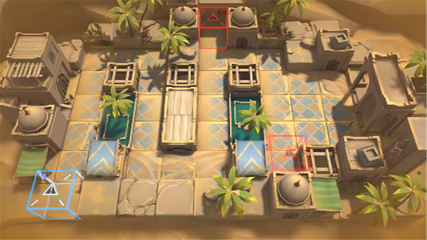

# 关卡一览————悖论模拟_诛邪义举

## 关卡一览

关卡编号: 悖论模拟_诛邪义举

关卡名称: 诛邪义举

目标点生命值: 1

敌人总数: 33

理智消耗: 0

## 关卡地图

## 敌人情况

| 敌人图片 | 敌人名称 | 数量  |
|---------|-----|-----|
| ./eneIcons/eneIcons/±äÒìɳµØÊÞ.png| 变异沙地兽  |   10  |
| ./eneIcons/eneIcons/±äÒìÑÒÖë.png| 变异岩蛛  |   18  |
| ./eneIcons/eneIcons/¸ßÄÜԴʯ³æ.png| 高能源石虫  |   5  |
| ./eneIcons/eneIcons/»û±ä׸ÉúÎï.png| 畸变赘生物  |   0  |
