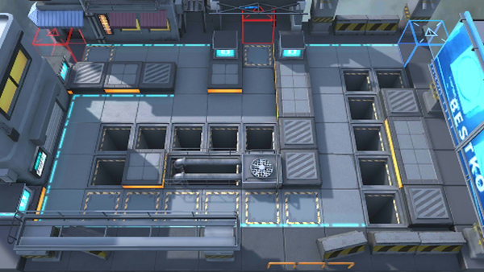

# 关卡一览————悖论模拟_超越重力

## 关卡一览

关卡编号: 悖论模拟_超越重力

关卡名称: 超越重力

目标点生命值: 1

敌人总数: 52

理智消耗: 0

## 关卡地图

## 敌人情况

| 敌人图片 | 敌人名称 | 数量  |
|---------|-----|-----|
| ./eneIcons/eneIcons/¿ñ±©ËÞÖ÷×鳤.png| 狂暴宿主组长  |   6  |
| ./eneIcons/eneIcons/ÁÔ¹·.png| 猎狗  |   20  |
| ./eneIcons/eneIcons/ËÞÖ÷Ê¿±ø×鳤.png| 宿主士兵组长  |   22  |
| ./eneIcons/eneIcons/ËÞÖ÷ÖØ×°×鳤.png| 宿主重装组长  |   4  |
