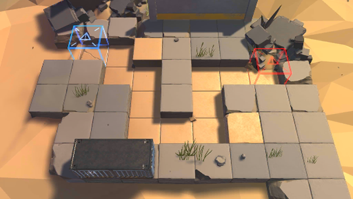

# 关卡一览————悖论模拟_迅捷之羽

## 关卡一览

关卡编号: 悖论模拟_迅捷之羽

关卡名称: 迅捷之羽

目标点生命值: 1

敌人总数: 48

理智消耗: 0

## 关卡地图

## 敌人情况

| 敌人图片 | 敌人名称 | 数量  |
|---------|-----|-----|
| ./eneIcons/eneIcons/·¥Ä¾»ú.png| 伐木机  |   3  |
| ./eneIcons/eneIcons/»ú¶¯¶Ü±ø.png| 机动盾兵  |   3  |
| ./eneIcons/eneIcons/ÁÔ¹·.png| 猎狗  |   8  |
| ./eneIcons/eneIcons/Ê¿±ø.png| 士兵  |   34  |
