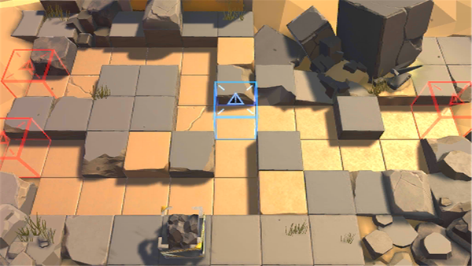

# 关卡一览————悖论模拟_量化治疗

## 关卡一览

关卡编号: 悖论模拟_量化治疗

关卡名称: 量化治疗

目标点生命值: 1

敌人总数: 32

理智消耗: 0

## 关卡地图

## 敌人情况

| 敌人图片 | 敌人名称 | 数量  |
|---------|-----|-----|
| ./eneIcons/eneIcons/¶¬ÁéѪÎ×.png| 冬灵血巫  |   1  |
| ./eneIcons/eneIcons/¸ß¼¶Îä×°ÈËÔ±.png| 高级武装人员  |   1  |
| ./eneIcons/eneIcons/¿ñ±©µÄÁÔ¹·pro.png| 狂暴的猎狗pro  |   7  |
| ./eneIcons/eneIcons/åóÊÖ×鳤.png| 弩手组长  |   7  |
| ./eneIcons/eneIcons/Êõʦ.png| 术师  |   12  |
| ./eneIcons/eneIcons/ÖØ×°·ÀÓùÕß.png| 重装防御者  |   4  |
