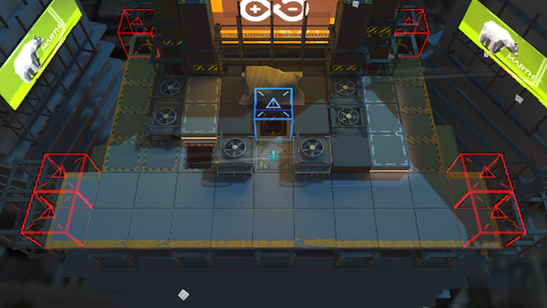

# 关卡一览————悖论模拟_锯子转呀转

## 关卡一览

关卡编号: 悖论模拟_锯子转呀转

关卡名称: 锯子转呀转

目标点生命值: 1

敌人总数: 74

理智消耗: 0

## 关卡地图

## 敌人情况

| 敌人图片 | 敌人名称 | 数量  |
|---------|-----|-----|
| ./eneIcons/eneIcons/±©Í½.png| 暴徒  |   28  |
| ./eneIcons/eneIcons/¿Õ½µ±ø.png| 空降兵  |   38  |
| ./eneIcons/eneIcons/È­ÈÐÎäÊ¿.png| 拳刃武士  |   8  |
