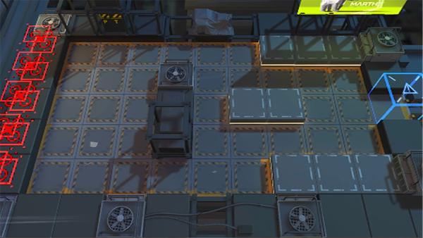

# 关卡一览————悖论模拟_防空炮手

## 关卡一览

关卡编号: 悖论模拟_防空炮手

关卡名称: 防空炮手

目标点生命值: 1

敌人总数: 81

理智消耗: 0

## 关卡地图

## 敌人情况

| 敌人图片 | 敌人名称 | 数量  |
|---------|-----|-----|
| ./eneIcons/eneIcons/±©û_.png| 暴鸰  |   4  |
| ./eneIcons/eneIcons/Ñý¹Ö.png| 妖怪  |   65  |
| ./eneIcons/eneIcons/Ñý¹ÖMKII.png| 妖怪MKII  |   10  |
| ./eneIcons/eneIcons/Óù4.png| 御4  |   2  |
