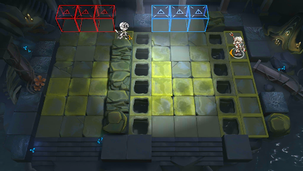

# 关卡一览————悖论模拟_陆上共舞

## 关卡一览

关卡编号: 悖论模拟_陆上共舞

关卡名称: 陆上共舞

目标点生命值: 1

敌人总数: 32

理智消耗: 0

## 关卡地图

## 敌人情况

| 敌人图片 | 敌人名称 | 数量  |
|---------|-----|-----|
| ./eneIcons/eneIcons/µ×º£»¬¶¯Õß.png| 底海滑动者  |   14  |
| ./eneIcons/eneIcons/¸»ÓªÑøµÄ»¬¶¯Õß.png| 富营养的滑动者  |   16  |
| ./eneIcons/eneIcons/¸»ÓªÑøµÄÆ®º½Õß.png| 富营养的飘航者  |   1  |
| ./eneIcons/eneIcons/Ê×ÑÔÕß.png| 首言者  |   1  |
