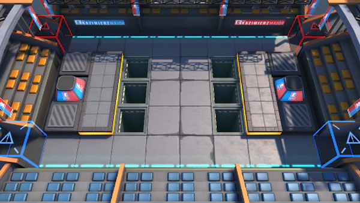

# 关卡一览————悖论模拟_险路伏击

## 关卡一览

关卡编号: 悖论模拟_险路伏击

关卡名称: 险路伏击

目标点生命值: 1

敌人总数: 19

理智消耗: 0

## 关卡地图

## 敌人情况

| 敌人图片 | 敌人名称 | 数量  |
|---------|-----|-----|
| ./eneIcons/eneIcons/°µ³±Ç¯ÊÞ.png| 暗潮钳兽  |   9  |
| ./eneIcons/eneIcons/ºôÐ¥ÆïÊ¿Íž«Èñ.png| 呼啸骑士团精锐  |   9  |
| ./eneIcons/eneIcons/ÖòÆïÊ¿Þ±Þ±°²ÄÈ.png| 烛骑士薇薇安娜  |   1  |
