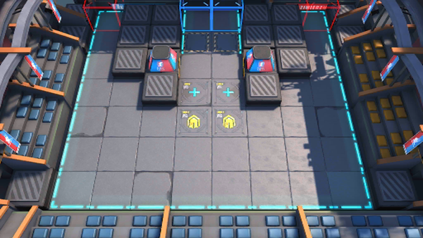

# 关卡一览————悖论模拟_陷阵之志

## 关卡一览

关卡编号: 悖论模拟_陷阵之志

关卡名称: 陷阵之志

目标点生命值: 1

敌人总数: 27

理智消耗: 0

## 关卡地图

## 敌人情况

| 敌人图片 | 敌人名称 | 数量  |
|---------|-----|-----|
| ./eneIcons/eneIcons/¡°ÐâÍ­¡±°Â¶ûĬ¡¤Ó¢¸ñÀ­.png| “锈铜”奥尔默·英格拉  |   1  |
| ./eneIcons/eneIcons/ÎÞÃû¶ÀÁ¢ÆïÊ¿.png| 无名独立骑士  |   6  |
| ./eneIcons/eneIcons/ÎÞÃû¾«ÈñÆïÊ¿.png| 无名精锐骑士  |   18  |
| ./eneIcons/eneIcons/ѵÁ·Óòб©Ç¯ÊÞ.png| 训练用残暴钳兽  |   2  |
