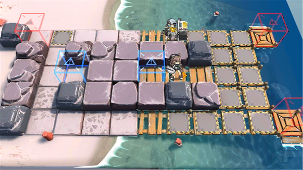

# 关卡一览————悖论模拟_静水流深

## 关卡一览

关卡编号: 悖论模拟_静水流深

关卡名称: 静水流深

目标点生命值: 1

敌人总数: 86

理智消耗: 0

## 关卡地图

## 敌人情况

| 敌人图片 | 敌人名称 | 数量  |
|---------|-----|-----|
| ./eneIcons/eneIcons/·ÛËé¹¥¼áÊÖ.png| 粉碎攻坚手  |   2  |
| ./eneIcons/eneIcons/¾Ñ»÷²½±ø.png| 狙击步兵  |   16  |
| ./eneIcons/eneIcons/¾Ñ»÷²½±ø×鳤.png| 狙击步兵组长  |   4  |
| ./eneIcons/eneIcons/ÆÛÁèÕß.png| 欺凌者  |   2  |
| ./eneIcons/eneIcons/ÒþÐÎåóÊÖ.png| 隐形弩手  |   4  |
| ./eneIcons/eneIcons/Դʯ³æ¡¤¦Â.png| 源石虫·β  |   58  |
