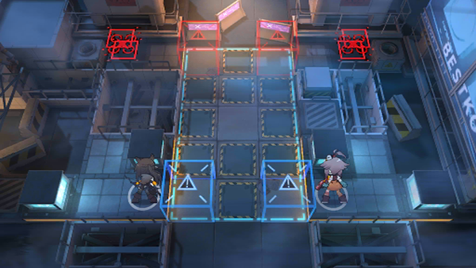

# 关卡一览————悖论模拟_魂骨尚存

## 关卡一览

关卡编号: 悖论模拟_魂骨尚存

关卡名称: 魂骨尚存

目标点生命值: 1

敌人总数: 27

理智消耗: 0

## 关卡地图

## 敌人情况

| 敌人图片 | 敌人名称 | 数量  |
|---------|-----|-----|
| ./eneIcons/eneIcons/±©û_.png| 暴鸰  |   2  |
| ./eneIcons/eneIcons/±©û_¡¤G.png| 暴鸰·G  |   6  |
| ./eneIcons/eneIcons/DZ·üÕß.png| 潜伏者  |   18  |
| ./eneIcons/eneIcons/ÖØ×°·ÀÓùÕß.png| 重装防御者  |   1  |
