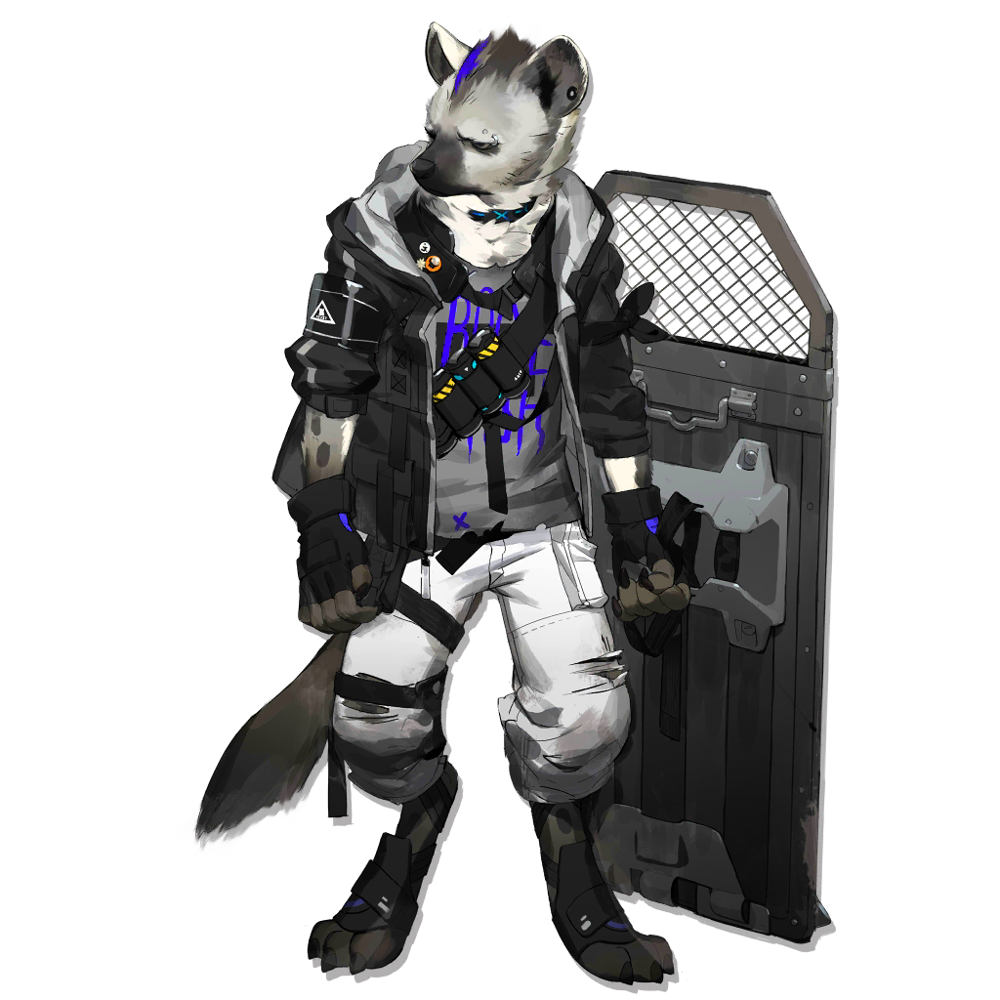

# 干员资料————斑点

## 干员信息

干员代号: 斑点

干员种族: 瑞柏巴

干员公招标签: 近战位,重装,防护,治疗

## 干员技能

| 技能一       | 技能二   | 技能三 |
| ------------ | -------- | ------ |
| 次级治疗模式 | 无 | 无 |

## 材料需求

### 精英化

该干员无法进行精英化。

### 技能1→7

| 材料名称      | 材料图片 | 数量  |
|---------|---------|-----|
| RMA70-12 |   |   1  |
| 固源岩 |   |   3  |
| 固源岩组 |   |   2  |
| 技巧概要·卷1 |   |   3  |
| 技巧概要·卷2 |   |   3  |
| 技巧概要·卷3 |   |   2  |
| 双酮 |   |   1  |
| 装置 |   |   1  |

### 技能专精

该干员无需技能专精。

### 模组

该干员暂无模组。
