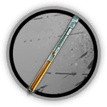

# 干员资料————早露

## 干员信息

干员代号: 早露

干员种族: 乌萨斯

干员公招标签: 远程位,狙击,输出,控场

## 干员技能

| 技能一       | 技能二   | 技能三 |
| ------------ | -------- | ------ |
| 分裂射击 | 雪崩击 | 攻击力强化·γ型 |

## 材料需求

### 精英化

| 材料名称      | 材料图片 | 数量  |
|---------|---------|-----|
| 改量装置 |   |   6  |
| 狙击双芯片 |   |   4  |
| 狙击芯片 |   |   5  |
| 聚酸酯 |   |   5  |
| 双极纳米片 |   |   4  |
| 糖 |   |   8  |

### 技能1→7

| 材料名称      | 材料图片 | 数量  |
|---------|---------|-----|
| 炽合金 |   |   4  |
| 代糖 |   |   5  |
| 技巧概要·卷1 |   |   10  |
| 技巧概要·卷2 |   |   24  |
| 技巧概要·卷3 |   |   8  |
| 聚酸酯 |   |   5  |
| 轻锰矿 |   |   5  |
| 双酮 |   |   4  |
| 糖 |   |   3  |
| 研磨石 |   |   5  |
| 异铁 |   |   4  |

### 技能专精

| 材料名称      | 材料图片 | 数量  |
|---------|---------|-----|
| RMA70-24 |   |   13  |
| 白马醇 |   |   4  |
| 炽合金 |   |   4  |
| 炽合金块 |   |   4  |
| 改量装置 |   |   7  |
| 固源岩组 |   |   11  |
| 技巧概要·卷3 |   |   105  |
| 聚合剂 |   |   6  |
| 聚合凝胶 |   |   13  |
| 三水锰矿 |   |   6  |
| 双极纳米片 |   |   6  |
| 酮阵列 |   |   12  |
| 异铁块 |   |   4  |
| 异铁组 |   |   4  |

### 模组

该干员暂无模组。
