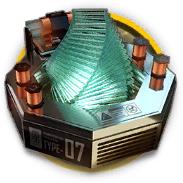

# 道具资料————晶体电子单元

## 道具资料

材料名称: 晶体电子单元

获取途径: 暂无直接获取方式

## 合成获取

| 原料名称 | 需求数量  |
|---------|-----|
| 炽合金块  |   1  |
| 晶体电路  |   1  |
| 聚合凝胶  |   2  |
## 干员需求

### 精英化
| 干员名称 | 需求数量  |
|---------|-----|
| 菲亚梅塔  |   3  |
| 歌蕾蒂娅  |   4  |
| 凯尔希  |   4  |
| 灵知  |   3  |
| 泥岩  |   4  |
| 帕拉斯  |   4  |
| 琴柳  |   4  |
| 山  |   4  |
| 夕  |   4  |

### 技能1→7
暂无干员升级技能需要此材料。

### 技能专精
| 干员名称 | 需求数量  |
|---------|-----|
| 阿米娅(近卫)  |   8  |
| 爱丽丝  |   4  |
| 暴雨  |   4  |
| 贝娜  |   4  |
| 布丁  |   2  |
| 豆苗  |   2  |
| 菲亚梅塔  |   6  |
| 风丸  |   4  |
| 歌蕾蒂娅  |   6  |
| 号角  |   6  |
| 灰毫  |   4  |
| 灰烬  |   6  |
| 假日威龙陈  |   6  |
| 九色鹿  |   4  |
| 卡夫卡  |   4  |
| 凯尔希  |   6  |
| 空弦  |   6  |
| 老鲤  |   6  |
| 灵知  |   6  |
| 令  |   6  |
| 龙舌兰  |   4  |
| 洛洛  |   4  |
| 迷迭香  |   12  |
| 蜜莓  |   4  |
| 暮落  |   4  |
| 帕拉斯  |   6  |
| 琴柳  |   6  |
| 山  |   6  |
| 深靛  |   2  |
| 蚀清  |   4  |
| 霜华  |   4  |
| 水月  |   6  |
| 夕  |   12  |
| 炎狱炎熔  |   4  |
| 耀骑士临光  |   6  |
| 夜半  |   4  |
| 异客  |   6  |
| 战车  |   4  |

### 模组
| 干员名称 | 需求数量  |
|---------|-----|
| 风笛  |   2  |
| 令  |   2  |
| 莫斯提马  |   2  |
| 夜莺  |   2  |
