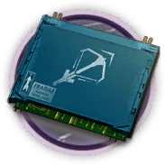

# 干员资料————杰西卡

## 干员信息

干员代号: 杰西卡

干员种族: 菲林

干员公招标签: 远程位,狙击,输出,生存

## 干员技能

| 技能一       | 技能二   | 技能三 |
| ------------ | -------- | ------ |
| 强力击·β型 | 掩护烟幕 | 无 |

## 材料需求

### 精英化

| 材料名称      | 材料图片 | 数量  |
|---------|---------|-----|
| 狙击芯片 |   |   3  |
| 狙击芯片组 |   |   5  |
| 聚酸酯 |   |   1  |
| 扭转醇 |   |   20  |
| 糖 |   |   1  |
| 异铁组 |   |   7  |

### 技能1→7

| 材料名称      | 材料图片 | 数量  |
|---------|---------|-----|
| RMA70-12 |   |   2  |
| 固源岩组 |   |   3  |
| 技巧概要·卷1 |   |   4  |
| 技巧概要·卷2 |   |   9  |
| 技巧概要·卷3 |   |   4  |
| 酮凝集 |   |   2  |
| 异铁 |   |   2  |
| 酯原料 |   |   4  |

### 技能专精

| 材料名称      | 材料图片 | 数量  |
|---------|---------|-----|
| RMA70-12 |   |   3  |
| 固源岩组 |   |   5  |
| 技巧概要·卷3 |   |   24  |
| 聚酸酯块 |   |   3  |
| 双极纳米片 |   |   2  |
| 糖聚块 |   |   3  |
| 酮阵列 |   |   4  |
| 异铁块 |   |   4  |

### 模组

该干员暂无模组。
