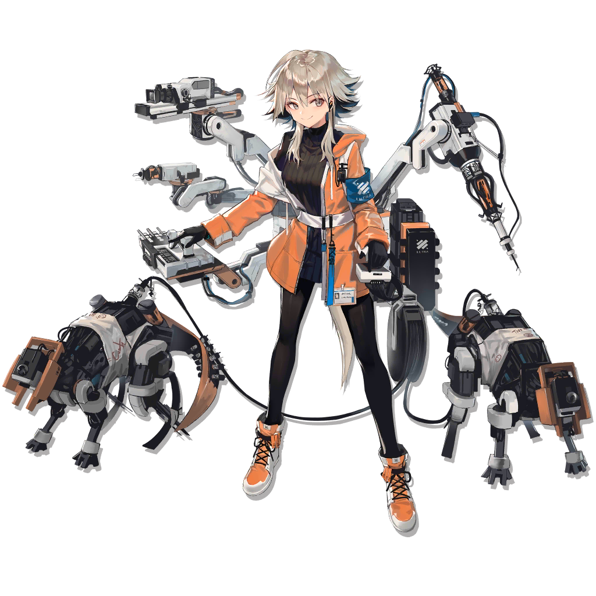

# 干员资料————梅尔

## 干员信息

干员代号: 梅尔

干员种族: 阿纳缇

干员公招标签: 远程位,辅助,召唤,控场

## 干员技能

| 技能一       | 技能二   | 技能三 |
| ------------ | -------- | ------ |
| 爆破回收 | 迷惑装置 | 无 |

## 材料需求

### 精英化

| 材料名称      | 材料图片 | 数量  |
|---------|---------|-----|
| RMA70-12 |   |   11  |
| 辅助双芯片 |   |   3  |
| 辅助芯片 |   |   4  |
| 聚酸酯 |   |   5  |
| 异铁块 |   |   6  |
| 装置 |   |   2  |

### 技能1→7

| 材料名称      | 材料图片 | 数量  |
|---------|---------|-----|
| 固源岩组 |   |   4  |
| 技巧概要·卷1 |   |   8  |
| 技巧概要·卷2 |   |   18  |
| 技巧概要·卷3 |   |   6  |
| 轻锰矿 |   |   4  |
| 酮凝集 |   |   4  |
| 研磨石 |   |   2  |
| 异铁 |   |   3  |
| 酯原料 |   |   7  |

### 技能专精

| 材料名称      | 材料图片 | 数量  |
|---------|---------|-----|
| RMA70-24 |   |   8  |
| 技巧概要·卷3 |   |   42  |
| 聚合剂 |   |   4  |
| 聚酸酯块 |   |   3  |
| 轻锰矿 |   |   2  |
| 三水锰矿 |   |   4  |
| 糖聚块 |   |   3  |
| 提纯源岩 |   |   9  |
| 研磨石 |   |   4  |
| 异铁块 |   |   3  |

### 模组

| 材料名称      | 材料图片 | 数量  |
|---------|---------|-----|
| 模组数据块 |   |   2  |
| 糖聚块 |   |   3  |
