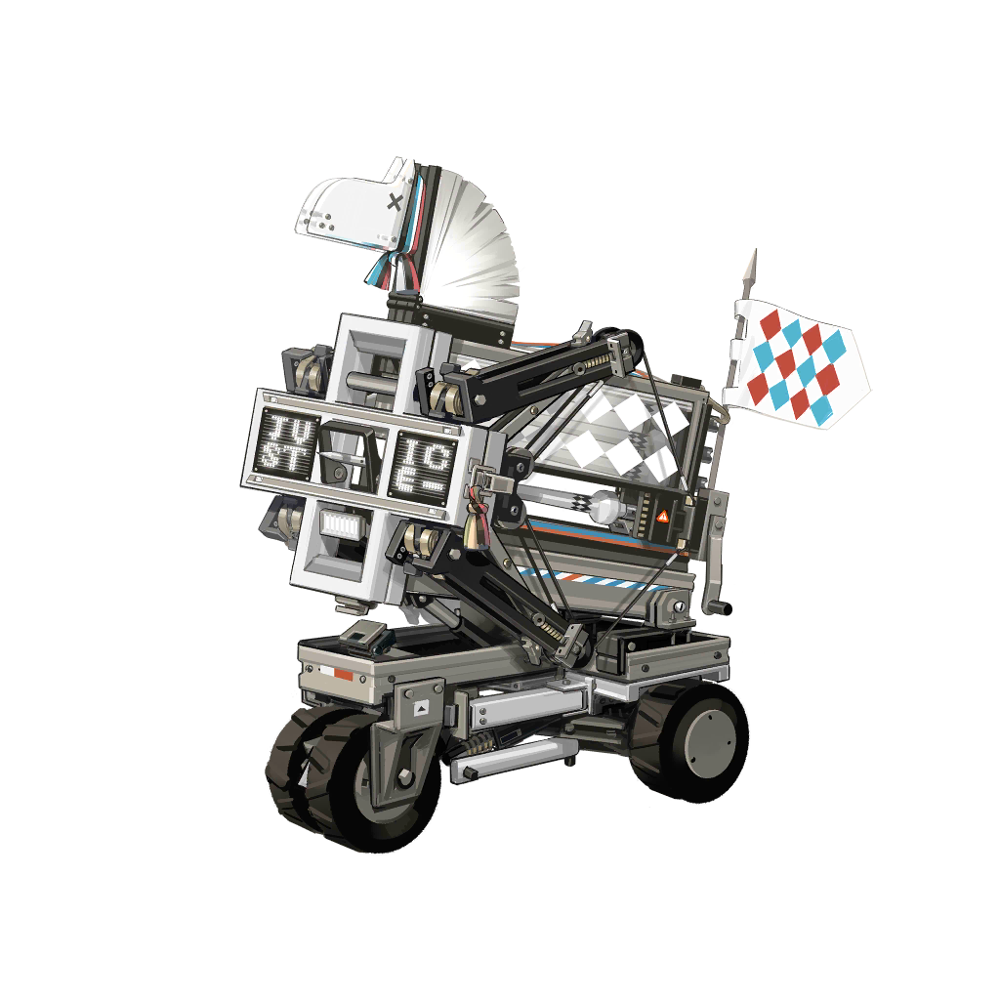

# 干员资料————正义骑士号

## 干员信息

干员代号: 正义骑士号

干员种族: 

干员公招标签: 远程位,狙击,支援,支援机械

## 干员技能

| 技能一       | 技能二   | 技能三 |
| ------------ | -------- | ------ |
| 无 | 无 | 无 |

## 材料需求

### 精英化

该干员无法进行精英化。

### 技能1→7

该干员无需升级技能。

### 技能专精

该干员无需技能专精。

### 模组

该干员暂无模组。
