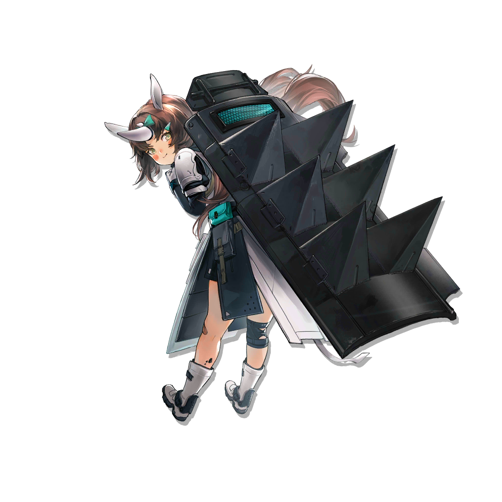

# 干员资料————泡泡

## 干员信息

干员代号: 泡泡

干员种族: 塞拉托

干员公招标签: 近战位,重装,防护

## 干员技能

| 技能一       | 技能二   | 技能三 |
| ------------ | -------- | ------ |
| “挨打” | 防御力强化·β型 | 无 |

## 材料需求

### 精英化

| 材料名称      | 材料图片 | 数量  |
|---------|---------|-----|
| 凝胶 |   |   16  |
| 扭转醇 |   |   8  |
| 糖 |   |   1  |
| 重装芯片 |   |   3  |
| 重装芯片组 |   |   5  |
| 装置 |   |   1  |

### 技能1→7

| 材料名称      | 材料图片 | 数量  |
|---------|---------|-----|
| 固源岩 |   |   2  |
| 固源岩组 |   |   3  |
| 技巧概要·卷1 |   |   4  |
| 技巧概要·卷2 |   |   9  |
| 技巧概要·卷3 |   |   4  |
| 破损装置 |   |   2  |
| 糖 |   |   3  |
| 异铁组 |   |   2  |

### 技能专精

| 材料名称      | 材料图片 | 数量  |
|---------|---------|-----|
| RMA70-24 |   |   2  |
| 炽合金块 |   |   4  |
| 改量装置 |   |   1  |
| 技巧概要·卷3 |   |   24  |
| 聚合凝胶 |   |   2  |
| 全新装置 |   |   3  |
| 三水锰矿 |   |   1  |
| 双极纳米片 |   |   2  |
| 提纯源岩 |   |   3  |
| 异铁块 |   |   2  |
| 异铁组 |   |   2  |

### 模组

该干员暂无模组。
