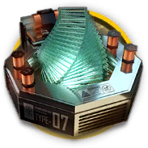

# 干员资料————灵知

## 干员信息

干员代号: 灵知

干员种族: 黎博利

干员公招标签: 远程位,辅助,削弱

## 干员技能

| 技能一       | 技能二   | 技能三 |
| ------------ | -------- | ------ |
| 高速思考 | 零度爆发 | 失温症 |

## 材料需求

### 精英化

| 材料名称      | 材料图片 | 数量  |
|---------|---------|-----|
| 炽合金块 |   |   7  |
| 辅助双芯片 |   |   4  |
| 辅助芯片 |   |   5  |
| 晶体电子单元 |   |   3  |
| 糖 |   |   8  |
| 异铁 |   |   5  |

### 技能1→7

| 材料名称      | 材料图片 | 数量  |
|---------|---------|-----|
| RMA70-12 |   |   4  |
| 半自然溶剂 |   |   3  |
| 固源岩 |   |   5  |
| 技巧概要·卷1 |   |   10  |
| 技巧概要·卷2 |   |   24  |
| 技巧概要·卷3 |   |   8  |
| 晶体元件 |   |   6  |
| 酮凝集 |   |   4  |
| 异铁 |   |   4  |
| 异铁碎片 |   |   4  |
| 酯原料 |   |   6  |

### 技能专精

| 材料名称      | 材料图片 | 数量  |
|---------|---------|-----|
| RMA70-24 |   |   3  |
| 白马醇 |   |   11  |
| 改量装置 |   |   3  |
| 技巧概要·卷3 |   |   105  |
| 晶体电路 |   |   4  |
| 晶体电子单元 |   |   6  |
| 精炼溶剂 |   |   8  |
| 聚合剂 |   |   6  |
| 凝胶 |   |   3  |
| 切削原液 |   |   4  |
| 轻锰矿 |   |   9  |
| 全新装置 |   |   5  |
| 三水锰矿 |   |   9  |
| 双极纳米片 |   |   6  |
| 酮阵列 |   |   8  |
| 五水研磨石 |   |   4  |
| 异铁块 |   |   6  |

### 模组

该干员暂无模组。
