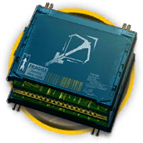

# 道具资料————狙击双芯片

## 道具资料

材料名称: 狙击双芯片

获取途径: 暂无直接获取方式

## 干员需求

### 精英化
| 干员名称 | 需求数量  |
|---------|-----|
| W  |   4  |
| 安哲拉  |   3  |
| 奥斯塔  |   3  |
| 白金  |   3  |
| 菲亚梅塔  |   4  |
| 寒芒克洛丝  |   3  |
| 黑  |   4  |
| 灰喉  |   3  |
| 灰烬  |   4  |
| 假日威龙陈  |   4  |
| 空弦  |   4  |
| 蓝毒  |   3  |
| 迷迭香  |   4  |
| 能天使  |   4  |
| 普罗旺斯  |   3  |
| 熔泉  |   3  |
| 慑砂  |   3  |
| 守林人  |   3  |
| 四月  |   3  |
| 送葬人  |   3  |
| 远牙  |   4  |
| 陨星  |   3  |
| 早露  |   4  |

### 技能1→7
暂无干员升级技能需要此材料。

### 技能专精
暂无干员技能专精需要此材料。

### 模组
暂无干员获取模组需要此材料。
