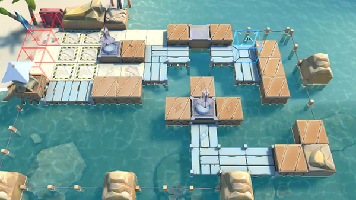

# 关卡一览————玻利瓦尔_多索雷斯换水口

## 关卡一览

关卡编号: 玻利瓦尔_多索雷斯换水口

关卡名称: 多索雷斯换水口

目标点生命值: 10

敌人总数: 400

理智消耗: 25

## 关卡地图

## 敌人情况

| 敌人图片 | 敌人名称 | 数量  |
|---------|-----|-----|
| ./eneIcons/eneIcons/¶¬ÁéÁÔÈ®.png| 冬灵猎犬  |   24  |
| ./eneIcons/eneIcons/¶¬ÁéÁÔÈ®pro.png| 冬灵猎犬pro  |   30  |
| ./eneIcons/eneIcons/¶¬ÁéѪÎ×.png| 冬灵血巫  |   5  |
| ./eneIcons/eneIcons/¶¬ÁéѪÎ×´óʦ.png| 冬灵血巫大师  |   12  |
| ./eneIcons/eneIcons/¿Ø³±Êõʦ.png| 控潮术师  |   0  |
| ./eneIcons/eneIcons/À³ËþÄáÑÇÅѱø.png| 莱塔尼亚叛兵  |   42  |
| ./eneIcons/eneIcons/À³ËþÄáÑÇÅѱø×鳤.png| 莱塔尼亚叛兵组长  |   97  |
| ./eneIcons/eneIcons/À³ËþÄáÑÇÇáÓïÕß.png| 莱塔尼亚轻语者  |   12  |
| ./eneIcons/eneIcons/À³ËþÄáÑÇÒ÷³ªÕß.png| 莱塔尼亚吟唱者  |   6  |
| ./eneIcons/eneIcons/Áì³±Ô±.png| 领潮员  |   0  |
| ./eneIcons/eneIcons/Áì³±Ô±¿ìͧ.png| 领潮员快艇  |   6  |
| ./eneIcons/eneIcons/ÂëÍ·Ë®ÊÖ.png| 码头水手  |   16  |
| ./eneIcons/eneIcons/ÂëÍ·Ë®ÊÖ³¤.png| 码头水手长  |   60  |
| ./eneIcons/eneIcons/ÄàÑÒ¾ÞÏñ.png| 泥岩巨像  |   3  |
| ./eneIcons/eneIcons/DZˮ¶Ó³¤.png| 潜水队长  |   59  |
| ./eneIcons/eneIcons/DZˮԱ.png| 潜水员  |   12  |
| ./eneIcons/eneIcons/Êõʦ¿ìͧ.png| 术师快艇  |   3  |
| ./eneIcons/eneIcons/Ë®ÊÖ³¤ÖØͧ.png| 水手长重艇  |   10  |
| ./eneIcons/eneIcons/Ë®ÊÖÖØͧ.png| 水手重艇  |   3  |
