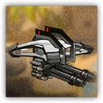

# 敌人档案————破片

## 敌人档案

敌人名称: 破片

攻击方式: 远程

## 敌人属性

| 耐久      | 攻击力  | 防御力 | 法术抗性 |
|---------|------|-----|------|
| B | C | D | A |

## 敌人特性
> 飞行单位；攻击发射两枚榴弹，击中目标及其周围单位防御力会在短时间内大幅度下降；不易被攻击；出发一段时间后会自动撤退
