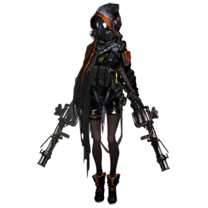

# 敌人档案————碎骨

## 敌人档案

敌人名称: 碎骨

攻击方式: 近战 远程

## 敌人属性

| 耐久      | 攻击力  | 防御力 | 法术抗性 |
|---------|------|-----|------|
| S | A+ | C | B |

## 敌人特性
> 未被阻挡时会发射榴弹，击中目标及其周围单位防御力会在短时间内大幅度下降；生命值降至一半以下时攻击力大幅度提升
