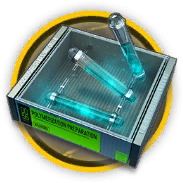

# 干员资料————絮雨

## 干员信息

干员代号: 絮雨

干员种族: 阿戈尔

干员公招标签: 远程位,医疗,治疗

## 干员技能

| 技能一       | 技能二   | 技能三 |
| ------------ | -------- | ------ |
| 定向诊断 | 痛觉抑制 | 无 |

## 材料需求

### 精英化

| 材料名称      | 材料图片 | 数量  |
|---------|---------|-----|
| 固源岩 |   |   8  |
| 晶体元件 |   |   13  |
| 糖 |   |   2  |
| 提纯源岩 |   |   9  |
| 医疗双芯片 |   |   3  |
| 医疗芯片 |   |   4  |

### 技能1→7

| 材料名称      | 材料图片 | 数量  |
|---------|---------|-----|
| 代糖 |   |   7  |
| 技巧概要·卷1 |   |   8  |
| 技巧概要·卷2 |   |   18  |
| 技巧概要·卷3 |   |   6  |
| 聚酸酯 |   |   3  |
| 凝胶 |   |   3  |
| 全新装置 |   |   2  |
| 酮凝集组 |   |   4  |
| 异铁 |   |   4  |

### 技能专精

| 材料名称      | 材料图片 | 数量  |
|---------|---------|-----|
| 炽合金块 |   |   4  |
| 技巧概要·卷3 |   |   42  |
| 晶体电路 |   |   3  |
| 聚合剂 |   |   4  |
| 聚合凝胶 |   |   3  |
| 扭转醇 |   |   4  |
| 全新装置 |   |   2  |
| 三水锰矿 |   |   3  |
| 双极纳米片 |   |   4  |
| 提纯源岩 |   |   10  |
| 五水研磨石 |   |   9  |

### 模组

该干员暂无模组。
