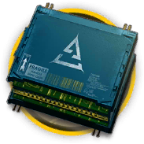

# 干员资料————红

## 干员信息

干员代号: 红

干员种族: 鲁珀

干员公招标签: 近战位,特种,快速复活,控场

## 干员技能

| 技能一       | 技能二   | 技能三 |
| ------------ | -------- | ------ |
| 处决模式 | 狼群 | 无 |

## 材料需求

### 精英化

| 材料名称      | 材料图片 | 数量  |
|---------|---------|-----|
| 固源岩 |   |   7  |
| 三水锰矿 |   |   7  |
| 特种双芯片 |   |   3  |
| 特种芯片 |   |   4  |
| 异铁组 |   |   14  |
| 装置 |   |   2  |

### 技能1→7

| 材料名称      | 材料图片 | 数量  |
|---------|---------|-----|
| 技巧概要·卷1 |   |   8  |
| 技巧概要·卷2 |   |   18  |
| 技巧概要·卷3 |   |   6  |
| 聚酸酯 |   |   5  |
| 聚酸酯组 |   |   3  |
| 轻锰矿 |   |   3  |
| 糖 |   |   3  |
| 糖组 |   |   5  |
| 源岩 |   |   10  |

### 技能专精

| 材料名称      | 材料图片 | 数量  |
|---------|---------|-----|
| 白马醇 |   |   3  |
| 改量装置 |   |   2  |
| 技巧概要·卷3 |   |   42  |
| 聚合剂 |   |   4  |
| 聚酸酯块 |   |   4  |
| 聚酸酯组 |   |   3  |
| 双极纳米片 |   |   4  |
| 糖组 |   |   1  |
| 酮阵列 |   |   11  |
| 异铁块 |   |   8  |

### 模组

| 材料名称      | 材料图片 | 数量  |
|---------|---------|-----|
| RMA70-24 |   |   3  |
| 模组数据块 |   |   2  |
