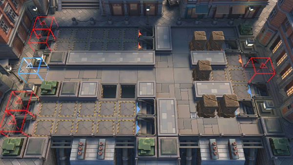

# 关卡一览————维多利亚_小丘郡郊野

## 关卡一览

关卡编号: 维多利亚_小丘郡郊野

关卡名称: 小丘郡郊野

目标点生命值: 10

敌人总数: 400

理智消耗: 25

## 关卡地图

## 敌人情况

| 敌人图片 | 敌人名称 | 数量  |
|---------|-----|-----|
| ./eneIcons/eneIcons/ÂûµÂÀ­.png| 蔓德拉  |   1  |
| ./eneIcons/eneIcons/Éî³Ø·½Õóսʿ.png| 深池方阵战士  |   28  |
| ./eneIcons/eneIcons/Éî³Ø·½ÕóÖ¸»Ó¹Ù.png| 深池方阵指挥官  |   6  |
| ./eneIcons/eneIcons/Éî³Ø·ÉÐбø.png| 深池飞行兵  |   6  |
| ./eneIcons/eneIcons/Éî³Ø·ÉÐдó¶Ó¶Ó³¤.png| 深池飞行大队队长  |   14  |
| ./eneIcons/eneIcons/Éî³Ø·Ù»ÙÕß.png| 深池焚毁者  |   2  |
| ./eneIcons/eneIcons/Éî³Ø»ïÓÑÎÀ¶Ó.png| 深池伙友卫队  |   14  |
| ./eneIcons/eneIcons/Éî³Ø»ïÓÑÓ°ÈÐ.png| 深池伙友影刃  |   14  |
| ./eneIcons/eneIcons/Éî³Ø¾Ñ»÷¶Ó³¤.png| 深池狙击队长  |   28  |
| ./eneIcons/eneIcons/Éî³Ø¾Ñ»÷ÊÖ.png| 深池狙击手  |   33  |
| ./eneIcons/eneIcons/Éî³ØËÜÄÜÊõʦ.png| 深池塑能术师  |   5  |
| ./eneIcons/eneIcons/Éî³ØÕì²ì±ø.png| 深池侦察兵  |   33  |
| ./eneIcons/eneIcons/Éî³ØÕì²ì¶Ó³¤.png| 深池侦察队长  |   58  |
| ./eneIcons/eneIcons/Éî³ØÕì²ìÈ®.png| 深池侦察犬  |   23  |
| ./eneIcons/eneIcons/Éî³ØÕì²ìÈ®pro.png| 深池侦察犬pro  |   113  |
| ./eneIcons/eneIcons/Éî³ØÖؼ×ÎÀÊ¿.png| 深池重甲卫士  |   13  |
| ./eneIcons/eneIcons/Éî³ØÖؼ×ÎÀÊ¿¶Ó³¤.png| 深池重甲卫士队长  |   9  |
