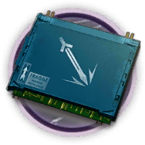

# 干员资料————缠丸

## 干员信息

干员代号: 缠丸

干员种族: 鬼

干员公招标签: 近战位,近卫,生存,输出

## 干员技能

| 技能一       | 技能二   | 技能三 |
| ------------ | -------- | ------ |
| 生命回复·β型 | 恶鬼之力 | 无 |

## 材料需求

### 精英化

| 材料名称      | 材料图片 | 数量  |
|---------|---------|-----|
| 固源岩 |   |   1  |
| 近卫芯片 |   |   3  |
| 近卫芯片组 |   |   5  |
| 糖组 |   |   10  |
| 酮凝集组 |   |   16  |
| 装置 |   |   1  |

### 技能1→7

| 材料名称      | 材料图片 | 数量  |
|---------|---------|-----|
| 技巧概要·卷1 |   |   4  |
| 技巧概要·卷2 |   |   9  |
| 技巧概要·卷3 |   |   4  |
| 聚酸酯 |   |   3  |
| 轻锰矿 |   |   2  |
| 糖 |   |   2  |
| 研磨石 |   |   2  |
| 源岩 |   |   5  |

### 技能专精

| 材料名称      | 材料图片 | 数量  |
|---------|---------|-----|
| RMA70-24 |   |   3  |
| 改量装置 |   |   2  |
| 技巧概要·卷3 |   |   24  |
| 聚合剂 |   |   2  |
| 聚酸酯块 |   |   4  |
| 轻锰矿 |   |   3  |
| 糖聚块 |   |   2  |
| 提纯源岩 |   |   4  |
| 研磨石 |   |   4  |

### 模组

| 材料名称      | 材料图片 | 数量  |
|---------|---------|-----|
| 模组数据块 |   |   1  |
| 研磨石 |   |   4  |
