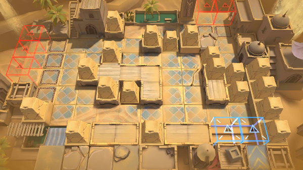

# 关卡一览————萨尔贡_长泉镇郊野

## 关卡一览

关卡编号: 萨尔贡_长泉镇郊野

关卡名称: 长泉镇郊野

目标点生命值: 10

敌人总数: 400

理智消耗: 25

## 关卡地图

## 敌人情况

| 敌人图片 | 敌人名称 | 数量  |
|---------|-----|-----|
| ./eneIcons/eneIcons/¡°ºì±ê¡±¾«Ó¢¸ù³ýÕß.png| “红标”精英根除者  |   7  |
| ./eneIcons/eneIcons/¡°ºì±ê¡±¾«Ó¢Éø͸Õß.png| “红标”精英渗透者  |   27  |
| ./eneIcons/eneIcons/¡°ºì±ê¡±Éø͸Õß.png| “红标”渗透者  |   9  |
| ./eneIcons/eneIcons/±äÒì¾ÞÑÒÖë.png| 变异巨岩蛛  |   10  |
| ./eneIcons/eneIcons/±äÒì¾ÞÑÒÖë¦Á.png| 变异巨岩蛛α  |   28  |
| ./eneIcons/eneIcons/±äÒìɳµØÊÞ.png| 变异沙地兽  |   22  |
| ./eneIcons/eneIcons/±äÒìÑÒÖë.png| 变异岩蛛  |   24  |
| ./eneIcons/eneIcons/±äÒìÑÒÖë¦Á.png| 变异岩蛛α  |   36  |
| ./eneIcons/eneIcons/»û±ä¶ñÐÔÁö.png| 畸变恶性瘤  |   0  |
| ./eneIcons/eneIcons/»û±äÌå¿þÀÜ.png| 畸变体傀儡  |   71  |
| ./eneIcons/eneIcons/»û±ä׸ÉúÎï.png| 畸变赘生物  |   0  |
| ./eneIcons/eneIcons/ÁÔ¹·pro.png| 猎狗pro  |   39  |
| ./eneIcons/eneIcons/È«Ï¢»ÃÓ°.png| 全息幻影  |   0  |
| ./eneIcons/eneIcons/È«Ï¢»ÃÓ°MK2.png| 全息幻影MK2  |   0  |
| ./eneIcons/eneIcons/Èø¿¨×È´ó½£ÊÖ.png| 萨卡兹大剑手  |   53  |
| ./eneIcons/eneIcons/Èø¿¨×ȵ¶Êõʦ.png| 萨卡兹刀术师  |   28  |
| ./eneIcons/eneIcons/Èø¿¨×Ⱦѻ÷ÊÖ.png| 萨卡兹狙击手  |   29  |
| ./eneIcons/eneIcons/Èø¿¨×Ⱦѻ÷×鳤.png| 萨卡兹狙击组长  |   17  |
