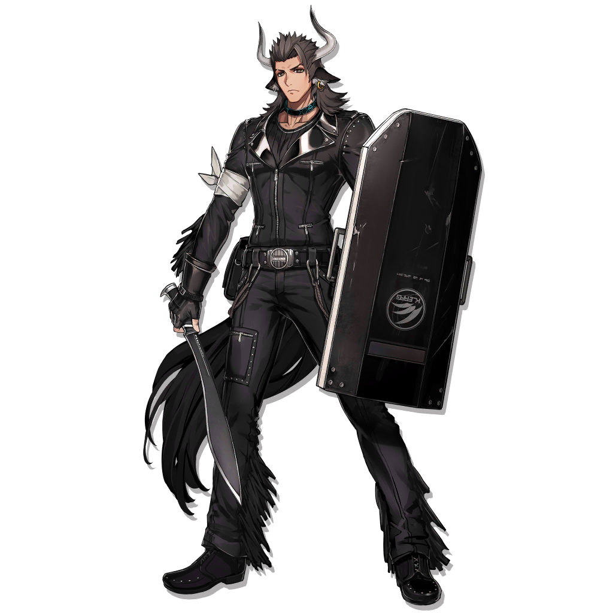
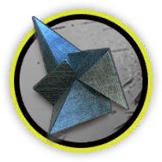
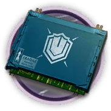
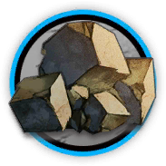
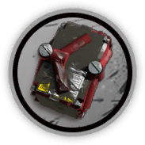
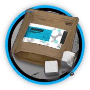
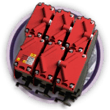
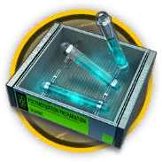
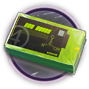
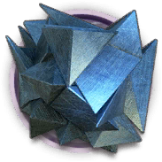

# 干员资料————角峰

## 干员信息

干员代号: 角峰

干员种族: 丰蹄

干员公招标签: 近战位,重装,防护

## 干员技能

| 技能一       | 技能二   | 技能三 |
| ------------ | -------- | ------ |
| 抗寒体质 | 体能强化 | 无 |

## 材料需求

### 精英化

| 材料名称      | 材料图片 | 数量  |
|---------|---------|-----|
| 轻锰矿 |   |   14  |
| 全新装置 |   |   7  |
| 异铁 |   |   1  |
| 重装芯片 |   |   3  |
| 重装芯片组 |   |   5  |
| 装置 |   |   1  |

### 技能1→7

| 材料名称      | 材料图片 | 数量  |
|---------|---------|-----|
| 固源岩 |   |   2  |
| 固源岩组 |   |   3  |
| 技巧概要·卷1 |   |   4  |
| 技巧概要·卷2 |   |   9  |
| 技巧概要·卷3 |   |   4  |
| 破损装置 |   |   2  |
| 糖 |   |   3  |
| 糖组 |   |   3  |

### 技能专精

| 材料名称      | 材料图片 | 数量  |
|---------|---------|-----|
| 改量装置 |   |   3  |
| 固源岩组 |   |   5  |
| 技巧概要·卷3 |   |   24  |
| 聚合剂 |   |   2  |
| 聚酸酯块 |   |   5  |
| 糖组 |   |   4  |
| 酮阵列 |   |   2  |
| 异铁块 |   |   3  |

### 模组

该干员暂无模组。
