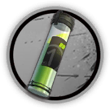

# 干员资料————赫拉格

## 干员信息

干员代号: 赫拉格

干员种族: 黎博利

干员公招标签: 近战位,近卫,输出,生存

## 干员技能

| 技能一       | 技能二   | 技能三 |
| ------------ | -------- | ------ |
| 满月 | 弦月 | 新月 |

## 材料需求

### 精英化

| 材料名称      | 材料图片 | 数量  |
|---------|---------|-----|
| 固源岩 |   |   6  |
| 近卫双芯片 |   |   4  |
| 近卫芯片 |   |   5  |
| 聚酸酯块 |   |   7  |
| 双极纳米片 |   |   4  |
| 糖 |   |   10  |

### 技能1→7

| 材料名称      | 材料图片 | 数量  |
|---------|---------|-----|
| 固源岩 |   |   5  |
| 固源岩组 |   |   5  |
| 技巧概要·卷1 |   |   10  |
| 技巧概要·卷2 |   |   24  |
| 技巧概要·卷3 |   |   8  |
| 轻锰矿 |   |   6  |
| 酮凝集 |   |   4  |
| 研磨石 |   |   4  |
| 异铁 |   |   4  |
| 异铁碎片 |   |   4  |
| 酯原料 |   |   6  |

### 技能专精

| 材料名称      | 材料图片 | 数量  |
|---------|---------|-----|
| RMA70-12 |   |   5  |
| 白马醇 |   |   4  |
| 改量装置 |   |   3  |
| 固源岩组 |   |   8  |
| 技巧概要·卷3 |   |   105  |
| 聚酸酯块 |   |   11  |
| 双极纳米片 |   |   12  |
| 糖聚块 |   |   4  |
| 糖组 |   |   4  |
| 酮阵列 |   |   12  |
| 五水研磨石 |   |   5  |
| 异铁块 |   |   19  |

### 模组

该干员暂无模组。
