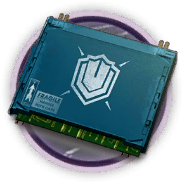

# 道具资料————重装芯片组

## 道具资料

材料名称: 重装芯片组

获取途径: 暂无直接获取方式

## 合成获取

| 原料名称 | 需求数量  |
|---------|-----|
| 医疗芯片组  |   3  |
## 干员需求

### 精英化
| 干员名称 | 需求数量  |
|---------|-----|
| 古米  |   5  |
| 坚雷  |   5  |
| 角峰  |   5  |
| 泡泡  |   5  |
| 蛇屠箱  |   5  |

### 技能1→7
暂无干员升级技能需要此材料。

### 技能专精
暂无干员技能专精需要此材料。

### 模组
暂无干员获取模组需要此材料。
