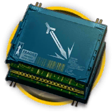
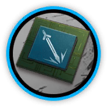

# 干员资料————铸铁

## 干员信息

干员代号: 铸铁

干员种族: 丰蹄

干员公招标签: 近战位,近卫,生存,输出

## 干员技能

| 技能一       | 技能二   | 技能三 |
| ------------ | -------- | ------ |
| 破浪回神 | 生命回复·γ型 | 无 |

## 材料需求

### 精英化

| 材料名称      | 材料图片 | 数量  |
|---------|---------|-----|
| 固源岩 |   |   7  |
| 近卫双芯片 |   |   3  |
| 近卫芯片 |   |   4  |
| 聚合凝胶 |   |   9  |
| 异铁组 |   |   13  |
| 装置 |   |   2  |

### 技能1→7

| 材料名称      | 材料图片 | 数量  |
|---------|---------|-----|
| 炽合金 |   |   4  |
| 技巧概要·卷1 |   |   8  |
| 技巧概要·卷2 |   |   18  |
| 技巧概要·卷3 |   |   6  |
| 聚酸酯 |   |   5  |
| 扭转醇 |   |   3  |
| 糖 |   |   3  |
| 酮凝集组 |   |   3  |
| 源岩 |   |   10  |

### 技能专精

| 材料名称      | 材料图片 | 数量  |
|---------|---------|-----|
| RMA70-12 |   |   3  |
| RMA70-24 |   |   3  |
| 白马醇 |   |   6  |
| 炽合金块 |   |   7  |
| 技巧概要·卷3 |   |   42  |
| 聚合剂 |   |   8  |
| 聚合凝胶 |   |   5  |
| 凝胶 |   |   2  |
| 三水锰矿 |   |   5  |
| 酮阵列 |   |   3  |
| 五水研磨石 |   |   3  |

### 模组

该干员暂无模组。
